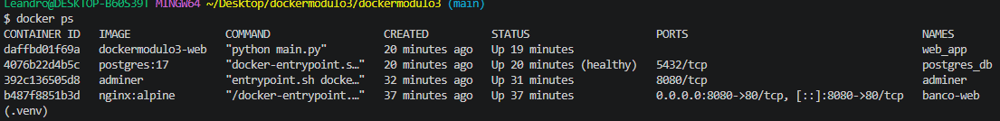
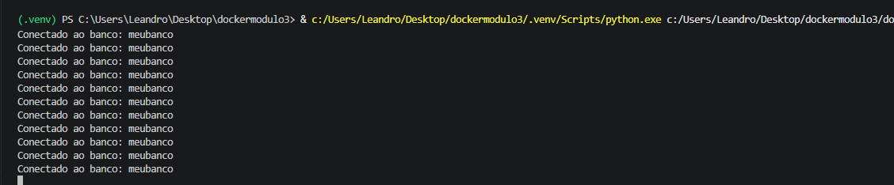
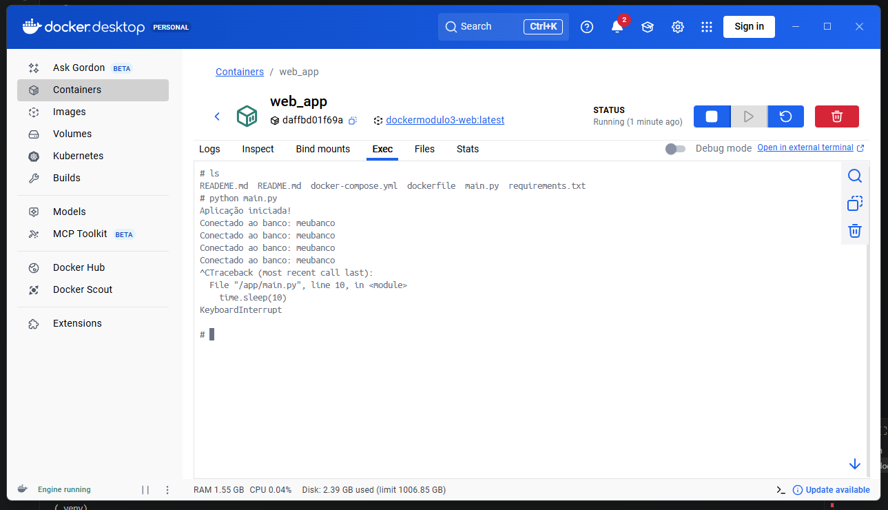

# Como Utilizar

### Subir os serviços

```bash
docker compose up -d
```

### Parar os containers

```bash
docker compose down
```

### Visualizar logs

```bash
docker compose logs -f
```

### Executar o profile (Adminer)

```bash
docker compose --profile tools up -d
```

Acesse:

```text
http://localhost:8080
```

### Limpar o ambiente

```bash
docker compose down -v
```

Esse comando remove os containers e o volume do banco de dados.



